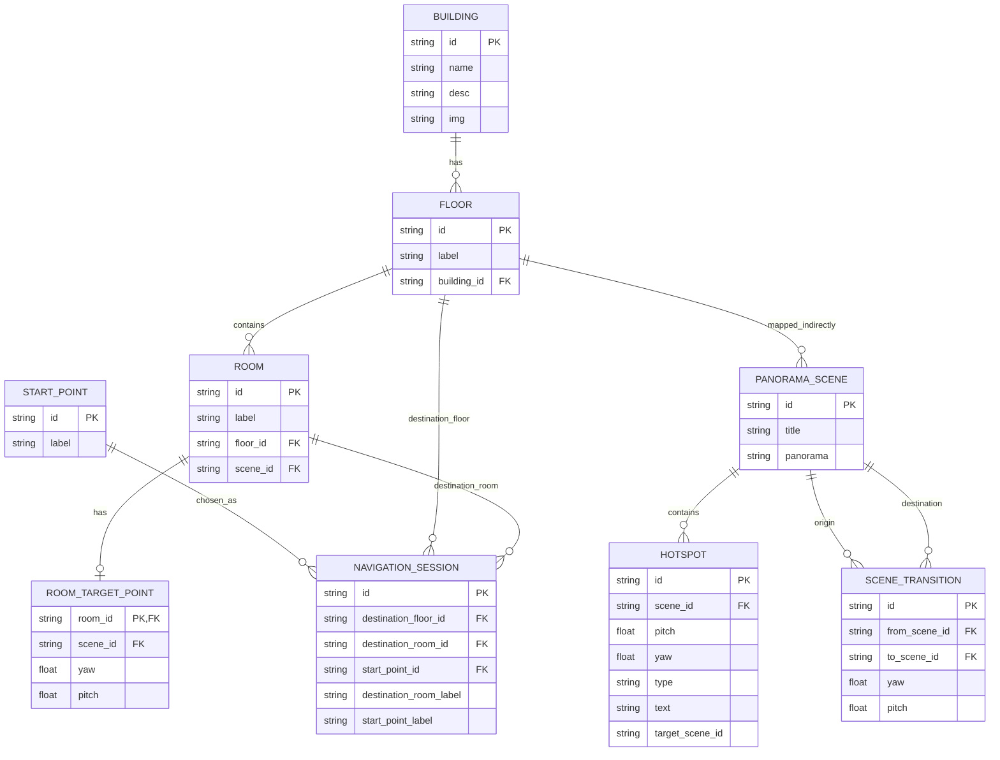

# ERD NavigaSift

ERD ini merepresentasikan model data yang saat ini dipakai aplikasi. Karena aplikasinya masih berbasis data hardcoded di frontend, diagram ini bersifat logis dan mengikuti struktur yang ada di kode.

## Catatan Struktur

- `BUILDING` mencakup kartu pada direktori bangunan, seperti FT 1, FT 2, dan Labtek.
- `FLOOR`, `ROOM`, dan `ROOM_TARGET_POINT` dipakai untuk navigasi FT1.
- `PANORAMA_SCENE` adalah scene panorama yang ditampilkan di viewer.
- `HOTSPOT` dan `SCENE_TRANSITION` merepresentasikan perpindahan antar scene.
- `NAVIGATION_SESSION` menggambarkan konfigurasi navigasi yang dipilih user saat menentukan lantai, ruangan tujuan, dan pintu masuk awal.

## Relasi Antar Entitas

- `BUILDING` ke `FLOOR`: satu bangunan memiliki banyak lantai.
- `FLOOR` ke `ROOM`: satu lantai memiliki banyak ruangan.
- `FLOOR` ke `PANORAMA_SCENE`: relasi bersifat tidak langsung melalui mapping ruangan ke scene.
- `PANORAMA_SCENE` ke `HOTSPOT`: satu scene dapat memiliki banyak hotspot.
- `PANORAMA_SCENE` ke `SCENE_TRANSITION`: satu scene dapat terhubung ke beberapa scene lain.
- `ROOM` ke `ROOM_TARGET_POINT`: satu ruangan memiliki satu titik arah utama.
- `ROOM` ke `PANORAMA_SCENE`: satu ruangan dipetakan ke satu scene panorama.
- `START_POINT` ke `NAVIGATION_SESSION`: satu sesi navigasi memilih satu titik awal.
- `FLOOR` ke `NAVIGATION_SESSION`: satu sesi navigasi memilih satu lantai tujuan.
- `ROOM` ke `NAVIGATION_SESSION`: satu sesi navigasi memilih satu ruangan tujuan.
- `NAVIGATION_SESSION`: menyimpan hasil pilihan user untuk navigasi.

## Ringkasan Alur

1. User memilih bangunan dari `BUILDING Directory`.
2. Jika memilih FT1, aplikasi membuka data `FLOOR` dan `ROOM` untuk navigasi indoor.
3. User memilih `START_POINT`, `FLOOR`, dan `ROOM` tujuan.
4. Aplikasi membentuk `NAVIGATION_SESSION` sementara di state frontend.
5. `PANORAMA_SCENE`, `HOTSPOT`, dan `SCENE_TRANSITION` dipakai untuk menuntun user sampai ke target ruangan.

## Deklarasi Kode

- `BUILDING` ditentukan di [src/BuildingDirectory.jsx](../src/BuildingDirectory.jsx#L3).
- `FLOOR` dan `ROOM` ditentukan di [src/App.jsx](../src/App.jsx#L6) dan [src/App.jsx](../src/App.jsx#L11).
- `START_POINT` ditentukan di [src/App.jsx](../src/App.jsx#L43).
- `PANORAMA_SCENE` ditentukan di [src/PanoramaViewer.jsx](../src/PanoramaViewer.jsx#L6).
- `HOTSPOT` muncul sebagai bagian dari data `hotSpots` di [src/PanoramaViewer.jsx](../src/PanoramaViewer.jsx#L6).
- `SCENE_TRANSITION` ditentukan di [src/PanoramaViewer.jsx](../src/PanoramaViewer.jsx#L389).
- `ROOM_SCENE_BY_ID` dan `ROOM_TARGET_POINTS` ditentukan di [src/PanoramaViewer.jsx](../src/PanoramaViewer.jsx#L295) dan [src/PanoramaViewer.jsx](../src/PanoramaViewer.jsx#L323).
- `NAVIGATION_SESSION` dibentuk dari state navigasi di [src/App.jsx](../src/App.jsx#L50) dan dipakai di [src/PanoramaViewer.jsx](../src/PanoramaViewer.jsx#L462).
